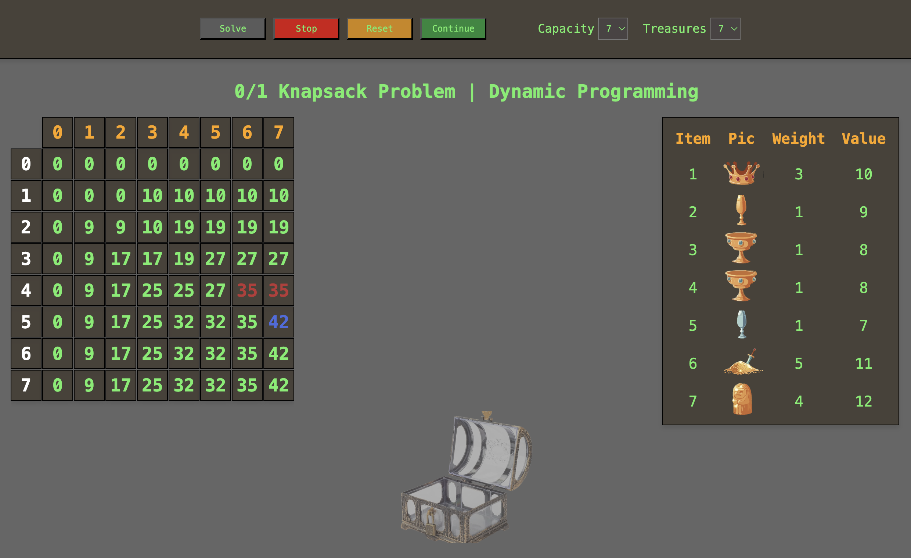

# Data Structures and Algorithms Exam Project
## - The 0/1 Knapsack Problem | Dynamic Programming

## Kort beskrivelse

Knapsack-problemet er et klassisk optimeringsproblem, hvor man forsøger at finde den mest værdifulde kombination af genstande, der kan passe i en taske med begrænset kapacitet.

I denne visualisering kan brugeren se, hvordan Dynamic Programming-algoritmen arbejder trin for trin for at beregne den optimale løsning.

## Deployet udgave
https://nikolajchristianmoeller.github.io/dsa-exam-project/

## Valg af algoritme og datastruktur
Vi har valgt at implementere Dynamic Programming-tilgangen, som er effektiv til at løse Knapsack-problemet i forhold til brute force.

I stedet for at teste alle mulige kombinationer beregner vi løsninger til mindre delproblemer og genbruger resultaterne.

Vi anvender en 2D-array (DP) til at gemme mellemresultater.

**Dimensioner:** _DP[i][w]_, hvor _i_ er antallet af genstande, og _w_ er taskens kapacitet.

**Indhold:** Hver celle indeholder den maksimale værdi, der kan opnås med kapaciteten _w_ ved brug af de første _i_ genstande.

## Sådan kører du applikationen på din lokale maskine

1. Klon repositoriet
   
   git clone https://github.com/NikolajChristianMoeller/dsa-exam-project.git
  
2. Installer dependencies
   
   npm install
  
3. Kør applikationen

   npm start

4. Åbn en browser
   
   http://127.0.0.1:5500/
